# Traveler2

A modern workflow template and instance platform that supports the creation, management, sharing, and collaboration of Forms, Travelers, and Binders.

## 📋 Project Overview

Traveler2 is a workflow management platform built with React + Node.js + MongoDB, providing form design and workflow instance tracking features.

### Core Features

- **Forms**: Create and manage workflow templates with various form widgets
- **Travelers**: Create workflow instances from templates with status tracking and input management
- **Binders**: Organize multiple travelers or binders into a binder

## 🛠️ Tech Stack

### Frontend
- **React 19** - Modern frontend framework
- **Material-UI (MUI)** - UI component library
- **React Query** - Data fetching and state management
- **TipTap** - Rich text editor

### Backend
- **Node.js + Express** - Backend service framework
- **MongoDB + Mongoose** - Database and ODM
- **JWT** - User authentication
- **JSON** - Form definition and storage

### Authentication
- Login via local database or external OpenLDAP

## 🖼️ Screenshots

### Authentication
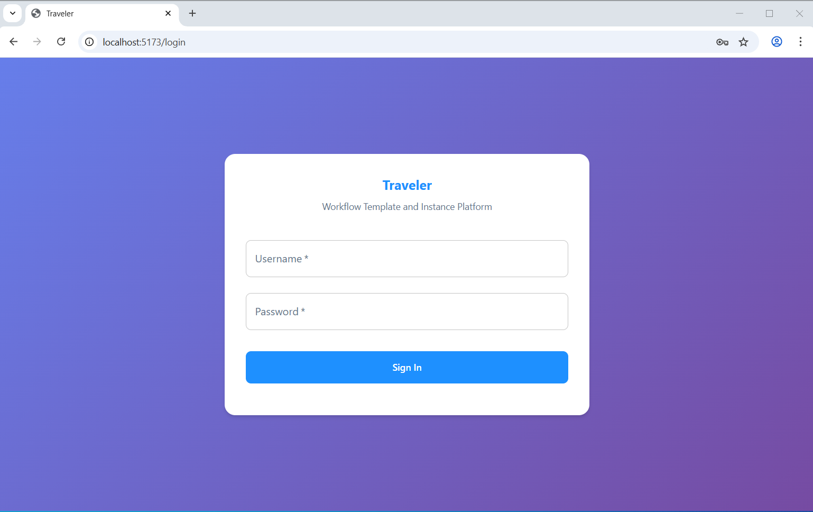
*User authentication and login interface*

### Home Dashboard
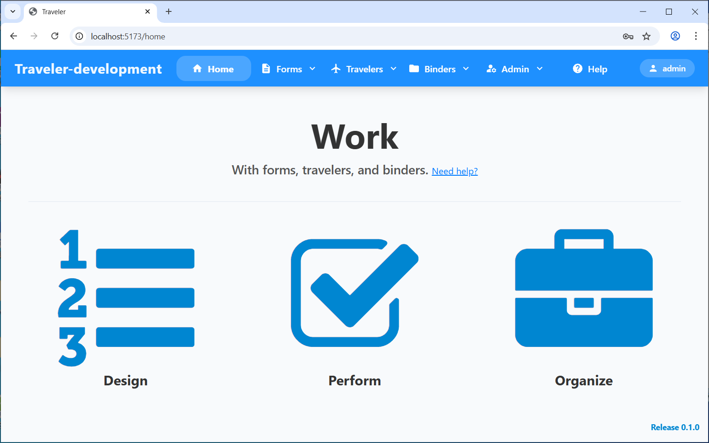
*Main dashboard with quick access to main features*

### Forms Management
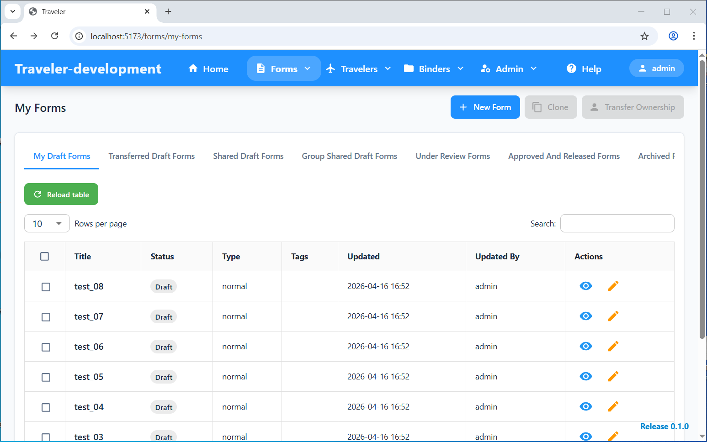
*Browse and manage all form templates*

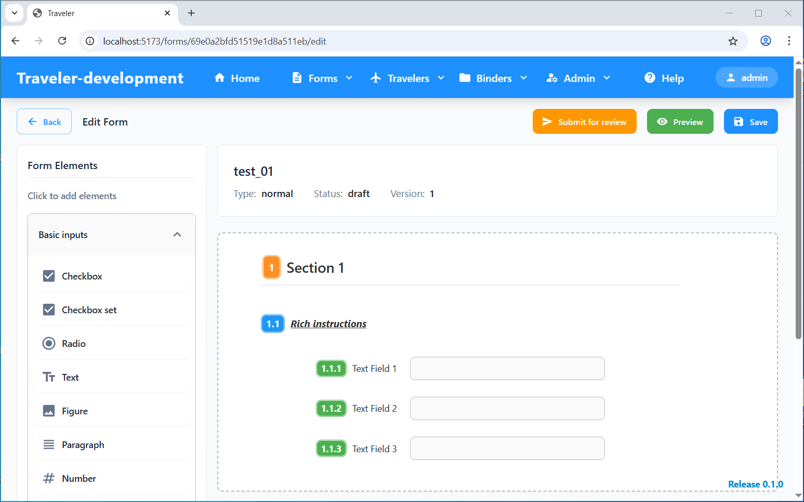
*Create and edit forms with various widgets*

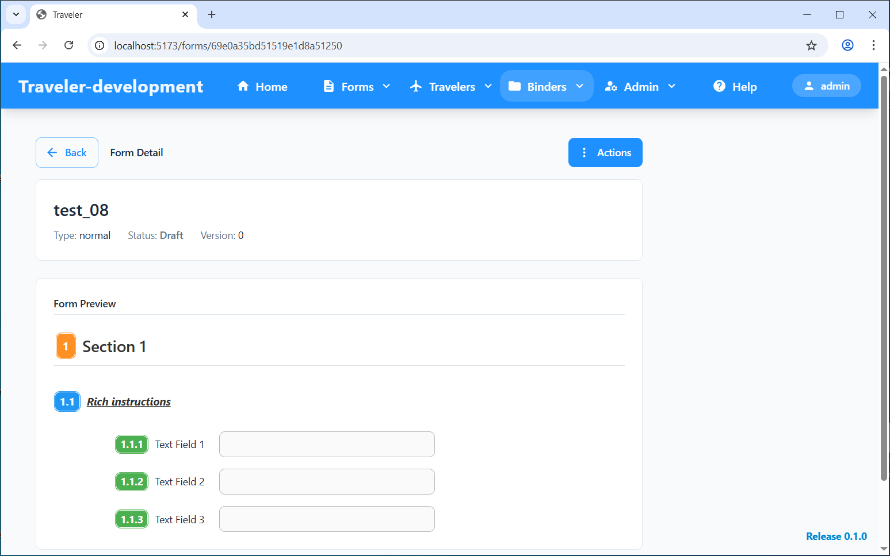
*View form details and definitions*

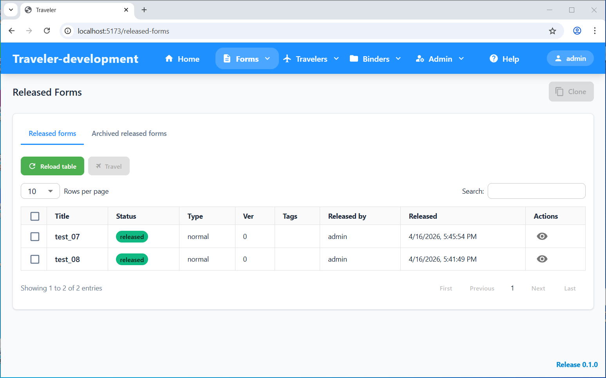
*Access released forms which are ready for travel*

### Traveler Management
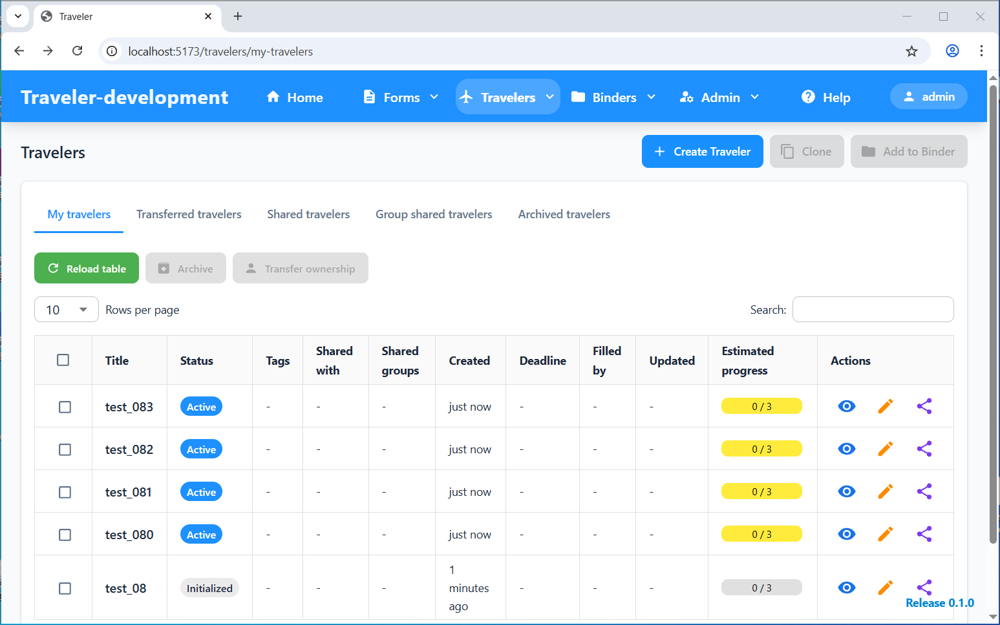
*View and manage workflow instances*

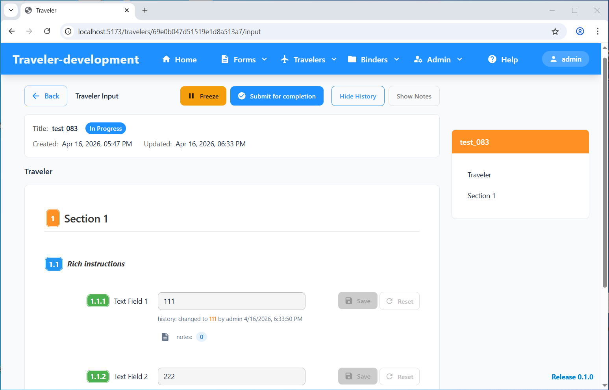
*Fill out workflow instances and track progress*

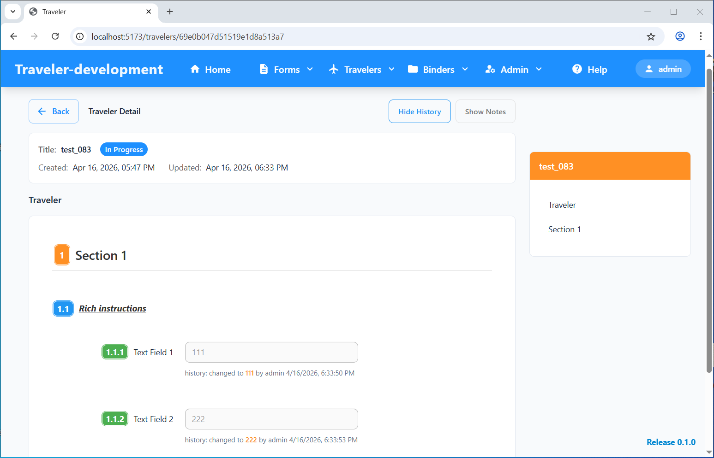
*View workflow instance details and history*

### Binder Organization
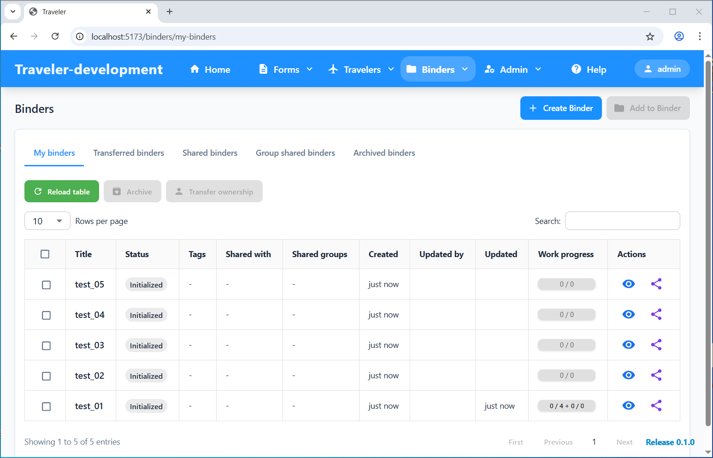
*Organize and manage binder collections*

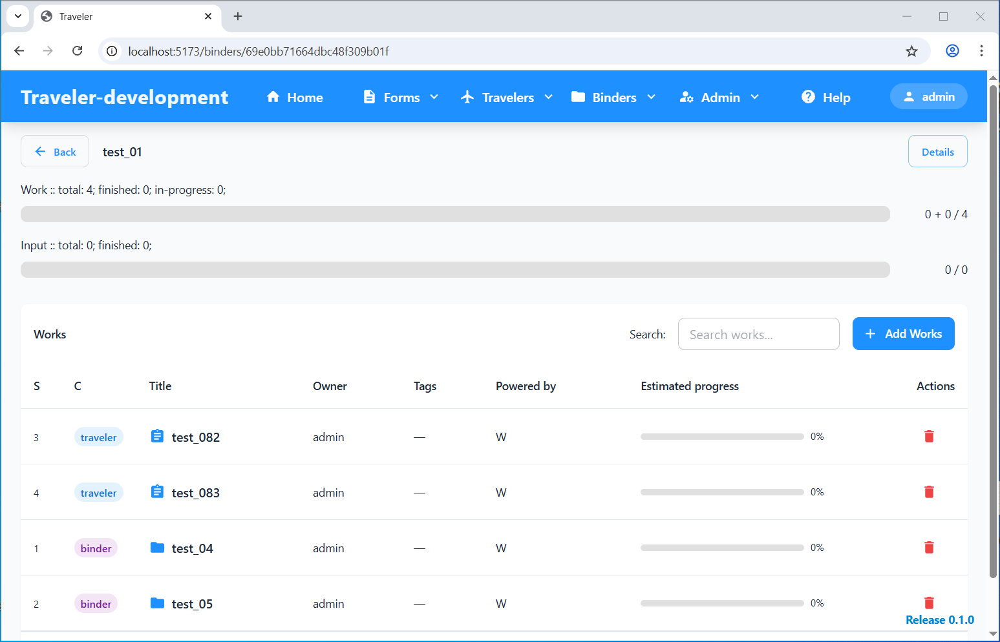
*View binder configuration and contents*

### User & Group Management
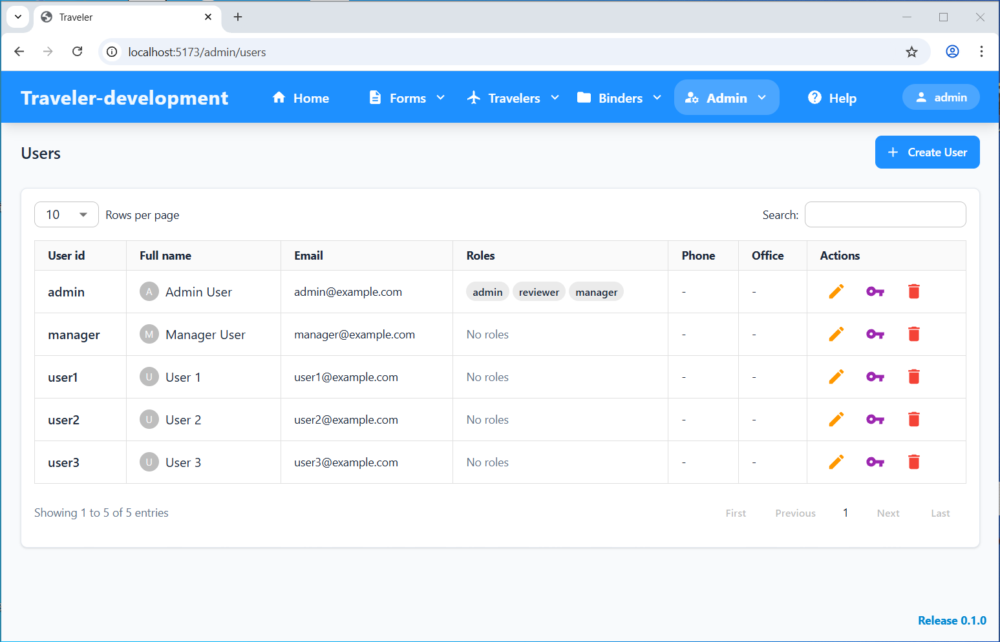
*Manage users and permissions*

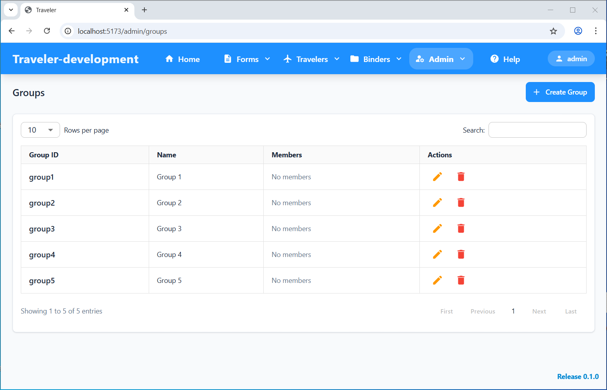
*Create and manage user groups*

## 📦 Installation

### Prerequisites

- Node.js >= 18.0.0
- MongoDB >= 5.0
- npm

### 1. Clone the Project

```bash
git clone <your-repository-url>
cd traveler2
```

### 2. Install Dependencies

#### Frontend Dependencies

```bash
cd frontend
npm install
```

#### Backend Dependencies

```bash
cd backend
npm install
```

### 3. Import Sample Data

Sample MongoDB backup files are provided for testing:

```bash
# Import sample data
mongorestore --db traveler2 docs/sample-data/traveler2
```

**Demo Account** (after importing sample data):
- Username: `admin`
- Password: `123456`

### 4. Start the Application

#### Development Mode

**Start Backend Server:**

```bash
cd backend
npm run dev
```

Backend service will start at `http://localhost:3000`

**Start Frontend Development Server:**

```bash
cd frontend
npm run dev
```

Frontend service will start at `http://localhost:5173`

#### Production Mode

**Build Frontend:**

```bash
cd frontend
npm run build
```

**Start Backend:**

```bash
cd backend
npm start
```

## 🚀 Usage

### 1. Access the Application

Open the browser and visit `http://localhost:5173`

### 2. User Login

- Login via local database or external OpenLDAP
- The login strategy is configured in backend

### 3. Create Forms

1. Click "Forms" → "My Forms"
2. Click "New Form" button
3. Use the widgets in palette to design form content
4. Save the form
5. Submit the form for review
6. Add reviewers for the form

### 4. Review and Release Forms
1. Reviewers approve the forms
2. Users release the approved forms

### 5. Create Workflow Instances

1. Click "Forms" → "Released Forms"
2. Select a form template
3. Click "Travel" button to create a workflow instance
4. Input data for the traveler

### 6. Create Workflow Binders

1. Click "Binders" → "My Binders"
2. Click "Create Binder"
3. Add related travelers or binders to a binder

## 📄 License

This project is licensed under the MIT License - see the [LICENSE](LICENSE) file for details
